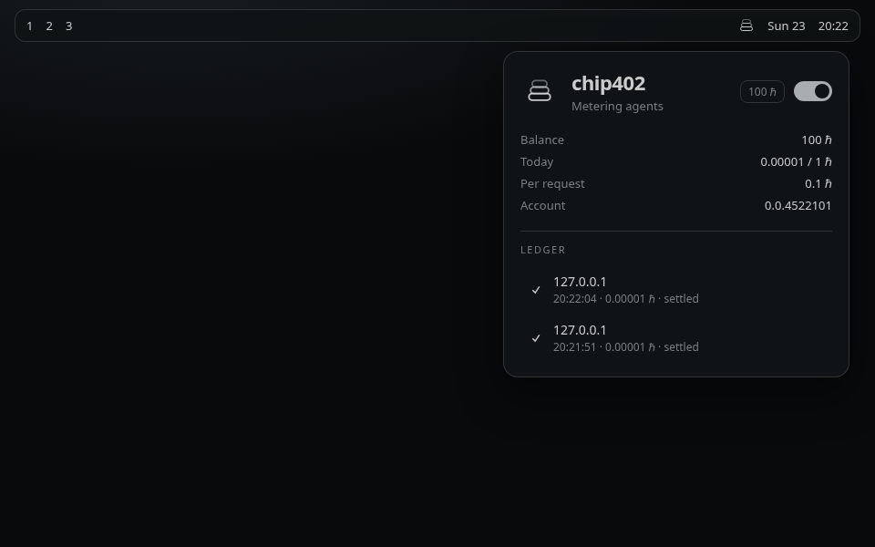
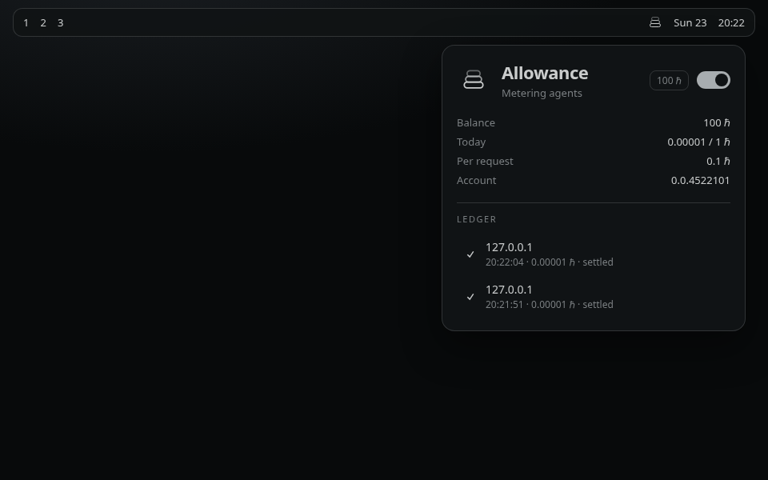

# chip402

A spend-capped wallet for local AI agents, living in the Omarchy bar.

Agents can pay [x402](https://x402.org) invoices on Hedera testnet. You set a daily cap and a per-request cap. One switch on the bar pauses every payment. HashPack (or the Hedera faucet) tops the account up; the plugin only holds a local **operator** key that cannot spend past the cap.

This is not a general-purpose wallet. It is pocket-money chips for agents.





## What you get

- Bar icon that greys out when paused and badges until the operator has USDC
- Panel with remaining pocket money, today's spend meter, caps, and a live ledger (HashScan links)
- Setup stepper in the panel: key → HBAR → key on record → USDC, one next action at a time
- Kill switch: the hero toggle. Off means nothing signs, even if an agent retries
- Local daemon on a unix socket at `$XDG_RUNTIME_DIR/chip402.sock` (mode `600`) so Claude Code
  / curl / any agent can pay — and no web page can, because browsers cannot open unix sockets
- Host allowlist (localhost only, until you opt in), https required for anything remote
- Caps are silent: chip402 never interrupts an agent to ask. It either pays or it does not
- Key file mode `600`, refused at start if looser

## Install

Needs Node.js 22+ and `npm`. The Hedera SDK is installed **outside** the plugin directory (the Omarchy validator forbids symlinks, and the SDK is large).

```bash
# from this checkout (until the GitHub repo is published)
omarchy plugin add /home/niko/Work/chip402 --enable --yes

# one-time runtime + operator key
~/.config/omarchy/plugins/chip402/bin/chip402 setup --watch
```

`setup` prints an EVM address. Spend is **USDC** on Hedera testnet (`0.0.429274`).

1. Send a little **HBAR** from the [Hedera faucet](https://portal.hedera.com/faucet) so the account exists and can pay association fees.
2. chip402 associates USDC on the next daemon refresh.
3. Send **testnet USDC** to the same address (Circle faucet or HashPack).

Then add the widget if the installer did not: `omarchy plugin enable chip402`.

Optional PATH helper:

```bash
mkdir -p ~/.local/bin
ln -sf ~/.config/omarchy/plugins/chip402/bin/chip402 ~/.local/bin/chip402
```

## Pay something

In one terminal:

```bash
chip402 demo          # x402 seller on :4403, 0.01 USDC per request
```

In another:

```bash
chip402 fetch http://127.0.0.1:4403/secret
```

The panel ledger should show the settlement. Click a row to open it on HashScan.

Agents talk to the daemon over its unix socket. Filesystem permissions are the
authorization, so there is no token to manage and nothing listening on a TCP port:

```bash
SOCK="$XDG_RUNTIME_DIR/chip402.sock"

curl -sS --unix-socket "$SOCK" http://chip402.local/status
curl -sS --unix-socket "$SOCK" http://chip402.local/fetch \
  -H 'content-type: application/json' \
  -d '{"url":"http://127.0.0.1:4403/secret"}'
curl -sS --unix-socket "$SOCK" http://chip402.local/pause \
  -H 'content-type: application/json' \
  -d '{"paused":true}'
```

For an agent that cannot use a unix socket, TCP is opt-in and needs a bearer token:

```bash
chip402 token          # writes ~/.config/chip402/token, mode 600
chip402 config tcp on  # then restart the daemon
curl -sS -H "authorization: Bearer $(cat ~/.config/chip402/token)" \
  http://127.0.0.1:4402/status
```

Over TCP the daemon validates the `Host` header and refuses any request carrying `Origin`
or `Sec-Fetch-*`, so a web page cannot drive it through DNS rebinding.

Right-click the bar icon to pause. `p` in the panel does the same.

## Remove

```bash
omarchy plugin remove chip402 --yes
# optional: wipe keys, config, and the SDK copy
rm -rf ~/.config/chip402 ~/.local/state/chip402 ~/.local/bin/chip402
```

Removal does not write to any other Omarchy config unless you previously enabled the widget — `plugin remove` takes the widget off the bar.

## How it works

1. An agent requests a URL.
2. If the server returns HTTP 402, chip402 reads `PAYMENT-REQUIRED`, picks `exact` on `hedera:testnet`, and checks the kill switch, host allowlist, per-request cap, and daily cap.
3. It builds a `TransferTransaction` whose `transactionId.accountId` is the x402 facilitator fee-payer (`0.0.9185802`), signs with the local operator key, and retries with `PAYMENT-SIGNATURE`.
4. The facilitator co-signs and submits. Network fees are not paid by the operator.
5. The panel watches `~/.local/state/chip402/state.json` and appends a ledger row.

Operator key: `~/.config/chip402/key` (ECDSA, DER, mode 600).
Config: `~/.config/chip402/config.json`.

## Defaults

| Cap | Default |
| --- | --- |
| Daily | 10 USDC |
| Per request | 1 USDC |
| Allowed hosts | `127.0.0.1`, `localhost`, `[::1]` |
| Network | Hedera testnet |
| Facilitator | `https://x402.org/facilitator` |

```bash
chip402 cap daily 0.5
chip402 cap request 0.01
chip402 allow api.example.com
chip402 pause
chip402 resume
```

## Reading the history

The panel is a receipt book: the last few payments, one line counting what was not paid today,
and cap changes summarised beside the sliders that made them. Nothing is discarded — the daemon
retains the last 50 entries either way, and `chip402 log` prints them whole, with the reasons the
panel abbreviates and the transaction ids.

```bash
chip402 log                       # everything retained
chip402 log --kind denied         # only what was refused, with the full reason
chip402 log --kind audit          # cap changes, pauses, hosts allowed
chip402 log --since 6h --json     # for piping into jq
chip402 tail                      # the same, refreshing every 2s
```

## License

MIT. External dependency: [`@hashgraph/sdk`](https://www.npmjs.com/package/@hashgraph/sdk) (Apache-2.0), installed into `~/.local/state/chip402/runtime` and never vendored inside the plugin tree.
